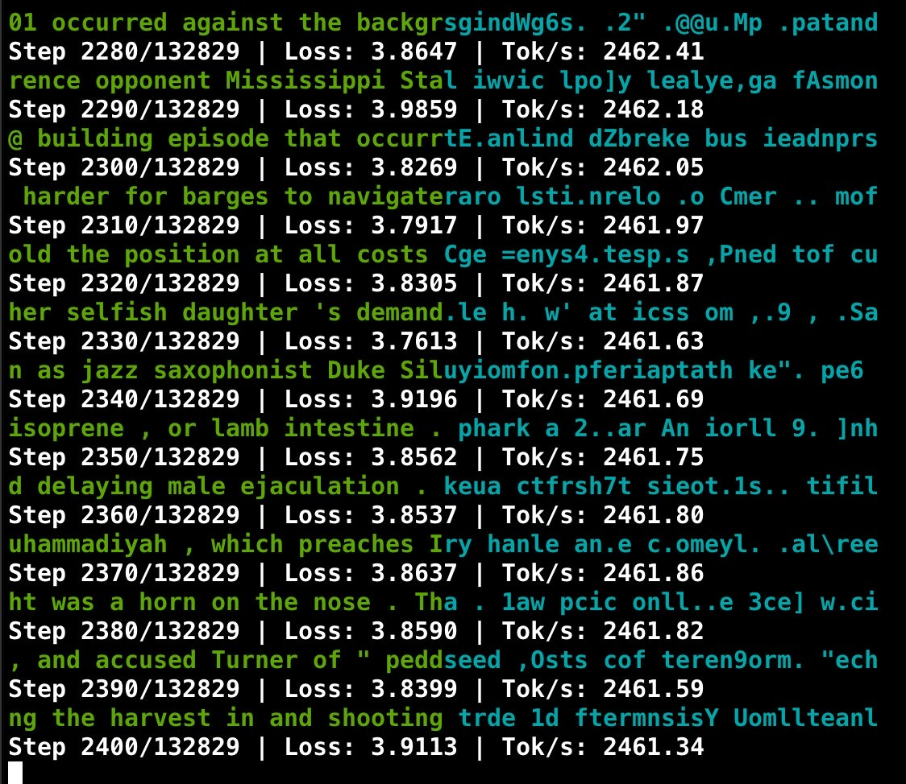
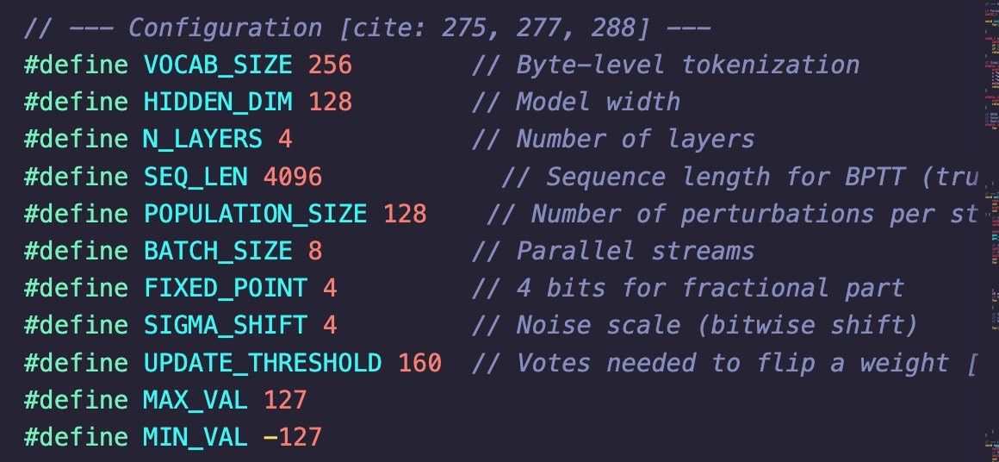

# EGGROLL in C

A minimalist, dependency-free implementation of the **EGGROLL** (Evolution Guided General Optimization via Low-rank Learning) algorithm in pure C.

This project demonstrates **integer-only training** of a language model directly on the CPU (optimized for Apple Silicon/M-series chips), completely bypassing the need for GPUs, floating-point arithmetic, or heavy ML frameworks like PyTorch or JAX.

## Key Features

*   **Pure C**: Zero external dependencies (uses standard libraries + `dispatch` for threading).
*   **Apple Silicon Optimized**: Vectorized operations using ARM NEON intrinsics and parallelized via Grand Central Dispatch (GCD).
*   **Integer Only**: Operates entirely on `int8` weights/activations with `int32` accumulation. No float math in the training loop.
*   **Gradient Free**: Uses Evolution Strategies (ES) with low-rank perturbations instead of backpropagation.

## Quick Start

### 1. Prepare Data
Ensure you have a text dataset named `input.txt` in the current directory.

### 2. Compile
```bash
clang -O3 full_trained_egg.c -o egg
```

### 3. Run
```bash
./egg
```



## Configuration



## References

*   **Original JAX Implementation**: [ESHyperscale/nano-egg](https://github.com/ESHyperscale/nano-egg)
*   **Original Paper & Project**: [EGGROLL Website](https://eshyperscale.github.io/)
